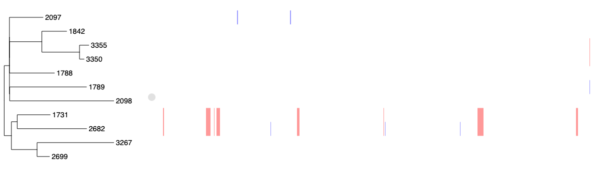
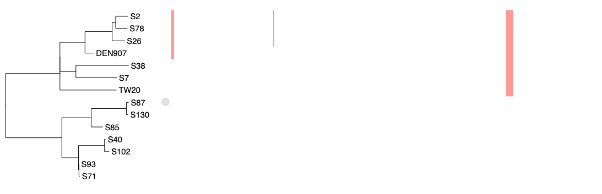

# Analysing whole genome alignments with Gubbins

## Introduction

[Gubbins](http://nickjcroucher.github.io/gubbins/) (Genealogies Unbiased By recomBinations In Nucleotide Sequences) is an algorithm that iteratively identifies loci containing elevated densities of base substitutions while concurrently constructing a phylogeny based on the putative point mutations outside of these regions. [Simulations demonstrate](https://academic.oup.com/nar/article/43/3/e15/2410982) the algorithm generates highly accurate reconstructions under realistic models of short-term diversification of sequences through both point mutation and recombination, and can be run on alignments of many hundreds of bacterial genome sequences. It is therefore not appropriate for looking at recombination across species-wide diversity - this can be done gene-by-gene using software such as [fastGEAR](https://pubmed.ncbi.nlm.nih.gov/28199698/). Instead, it works on **samples of limited diversity, sharing a recent common ancestor** - a [strain or lineage](https://www.nature.com/articles/s41396-020-00867-w).

The time taken for the algorithm to converge on a stable solution increases approximately quadratically with the number of samples; this increase can be ameliorated to some extent by using faster and/or simpler phylogenetic algorithms to generate trees within the analysis pipeline. The input should be a **whole genome sequence alignment**; there is no need to remove accessory genome loci, as the algorithm should cope with regions of missing data. Gubbins will not produce a sensible alignment on concantentations of core genes output by software such as [Roary](https://sanger-pathogens.github.io/Roary/) or [Panaroo](https://github.com/gtonkinhill/panaroo), because it requires information on the spatial distribution of polymorphisms across the genome.

Gubbins cannot distinguish elevated densities of polymorphisms arising through recombination from other potential causes. These may be assembly or alignment errors, mutational hotspots or regions of the genome with relaxed selection. Such false positives are more likely to arise on longer branches within a phylogeny; it is recommended that populations be subdivided into smaller groups of less diverse samples that can each be independently analysed with Gubbins. This can be achieved with software such as [PopPUNK](https://poppunk.net/) or [fastBAPS](https://www.ncbi.nlm.nih.gov/labs/pmc/articles/PMC6582336/). Further discussion of potential confounding factors in the analysis of such population genomic datasets [can be found elsewhere](https://pubmed.ncbi.nlm.nih.gov/23382424/).

## Description of the algorithm

In the first iteration,

* Gubbins first identifies a full set of polymorphic sites, F, and uses these to construct a phylogeny.
* The base substitutions explaining F is then reconstructed using this tree and a nucleotide substitution model.
* A spatial scanning statistic is then iteratively applied to the base substitutions reconstructed as occurring on each branch, to identify all regions with an elevated density of base substitutions.
* These regions are assumed to have arisen through recombination, and base substitutions within these regions in the taxa descended from the branch are excluded from the set F, to leave a set of substitutions assumed to occur through point mutation, P

Then in subsequent iterations,

* A new, more accurate, phylogeny is constructed from the recombination-filtered set of polymorphic sites P, and the full set of polymorphisms, F, reconstructed onto this tree
* Recombinations are identified, improving the selection of P from F, enabling the improvement of the tree in the next iteration

Iterations continue until the same tree is observed in multiple iterations, or the maximum number of iterations is reached.

In terms of runtime, the first iteration requires a tree to be generated from all polymorphic sites (i.e. F rather than P), as none have yet been excluded as recombinant, and therefore this step is usually the slowest part of the analysis. Hence options are provided for faster tree building algorithms to be used in the first iteration, and more accurate tree building algorithms to be used in later iterations.

## Installation and dependencies

Gubbins is a command line program designed to be run on Linux or Mac OSX systems and requires Python version 3.8 or greater. Gubbins can also be run on Windows operating systems using the Powershell within Windows >=10, a Bio-Linux virtual machine. The recommended installation approach is to use conda:

```
conda config --add channels r
conda config --add channels defaults
conda config --add channels conda-forge
conda config --add channels bioconda
conda install gubbins
```

Alternative approaches are described on the [Github page](https://github.com/nickjcroucher/gubbins). Gubbins relies on multiple other phylogenetic software packages, including:

* [RAxML](https://doi.org/10.1093/bioinformatics/btu033)
* [IQTree](https://doi.org/10.1093/molbev/msaa015)
* [RAxML-NG](https://doi.org/10.1093/bioinformatics/btz305)
* [FastTree](https://doi.org/10.1371/journal.pone.0009490)
* [Rapidnj](https://doi.org/10.1007/978-3-540-87361-7_10)

These will automatically be installed within the conda environment. Please cite any of these methods you use as part of a Gubbins analysis - these are listed in a `.log` file output by Gubbins.

## Input files and workflow

The required input file for Gubbins is a whole genome FASTA alignment. Each sequence should have a unique identifier, and special characters should be avoided. The sequences should only use the characters `ACGT` (DNA bases), `N` (unknown base) or `-` (alignment gap). If a starting tree is to be included, then this should be a Newick format.

The alignment is most easily generated through mapping sequences against a reference sequence. This can be achieved with the popular mapping software Snippy, following the instructions on the relevant [Github repository](https://github.com/tseemann/snippy). Alternatively, the alignment can be generated using the Gubbins script `generate_ska_alignment.py`, which creates an alignment using [SKA2](https://github.com/bacpop/ska.rust), which can be installed through `conda install -c bioconda ska2` (SKA2 is included when installing Gubbins through conda). For instance,

```
generate_ska_alignment.py --reference seq_X.fa --input input.list --out out.aln
```

Where `input.list` is a tab-delimited file with one row per isolate. The first column should be the isolate name, and the subsequent entries on the same row should contain the corresponding sequence data - this may be a single FASTA assembly, or multiple FASTQ raw read files. The alignment will be reformatted for Gubbins (e.g. modifying isolate names and removing non-N IUPAC ambiguity codes) by this script.

The alignment can then be analysed with Gubbins:

```
run_gubbins.py --prefix gubbins_out out.aln
```

The output of this analysis can be interactively visualised and analysed using [Phandango](https://jameshadfield.github.io/phandango/#/), and publication-ready figures can be generated with [plot_gubbins.R](docs/gubbins_plotting.md) or [RCandy](https://github.com/ChrispinChaguza/RCandy). Further downstream analysis can use [BactDating](https://xavierdidelot.github.io/BactDating/) to generate a time-calibrated phylogeny, and [SkyGrowth](https://pubmed.ncbi.nlm.nih.gov/29432602/) for reconstructing past population sizes. For an example of such a workflow, see [D'Aeth *et al*](https://elifesciences.org/articles/67113).

## Input options

Version 3 of Gubbins has an extended range of analysis options:

### Input and output options

Gubbins can take a starting tree, to speed up the analysis - you may have generated one as part of an initial analysis, e.g. with [PopPUNK](https://poppunk.net/). This must contain all the taxa in the input alignment, but superfluous taxa will be ignored (e.g. within a species-wide tree). The analysis can also be sped up by using multiple threads, if you have multiple processors available to you, using `--threads`. Almost all parts of the Gubbins algorithm are multithreaded.

Additionally, the final Gubbins tree can be time calibrated using [LSD](https://github.com/tothuhien/lsd2), implemented within [IQtree](https://github.com/iqtree/iqtree2). This requires an input dating file to be provided using the `--date` flag. This file should contain two tab-separated columns: the first with the names of the sequences in the alignment, and the second with dates of isolation in YYYY-MM-DD, YYYY-MM, or YYYY format (ranges are also acceptable; see the IQtree manual for details on parsing date information). The LSD method can analyse datasets in which dates are missing. 

```
  --prefix PREFIX, -p PREFIX
                        Add a prefix to the final output filenames (default: None)
  --starting-tree STARTING_TREE, -s STARTING_TREE
                        Starting tree (default: None)
  --date DATE, -D DATE  Two-column text file in which the second column is the date of isolation in YYYY,YYYY-MM or YYYY-MM-DD format (default: None)
  --use-time-stamp, -u  Use a time stamp in file names (default: False)
  --version             show program's version number and exit
  --threads THREADS, -c THREADS
                        Number of threads to use for parallelisation (default: 1)
  --verbose, -v         Turn on debugging (default: False)
  --no-cleanup, -n      Do not cleanup intermediate files (default: False)
```

### Data processing options

Gubbins can remove duplicate or low-quality sequences from samples. It can also run in a special mode (`--pairwise`) to identify recombinations distinguishing two sequences, without generating a tree.

```
  --pairwise            Compare two sequences (without using a tree) (default: False)
  --filter-percentage FILTER_PERCENTAGE, -f FILTER_PERCENTAGE
                        Filter out taxa with more than this percentage of gaps (default: 25.0)
  --remove-identical-sequences, -d
                        Remove identical sequences (default: False)
```

### Tree building options

Multiple phylogenetic packages can be used to run a Gubbins analysis. Typically, we would recommend a fast, simple tree builder is used for the first phylogeny (`--first-tree-builder` set to `star`,`rapidnj`, `iqtree-fast` or `fasttree`), and a more accurate, slower maximum-likelihood tree builder is used for subsequent iterations (`--tree-builder` set to `raxml`, `raxmlng` or `iqtree`). The `hybrid` mode replicates the behaviour from earlier versions of Gubbins, in which `fasttree` is used for the first tree, and `raxml` is used for later iterations.

The robustness of the final tree can be assessed using [bootstraps](https://onlinelibrary.wiley.com/doi/10.1111/j.1558-5646.1985.tb00420.x), [transfer bootstraps](https://www.nature.com/articles/s41586-018-0043-0) or a [Shimodaira–Hasegawa test](https://academic.oup.com/sysbio/article/49/4/652/1678908) (`--sh-test`) of node likelihoods.

```
  --tree-builder {raxml,raxmlng,iqtree,iqtree-fast,fasttree,hybrid,rapidnj}, -t {raxml,raxmlng,iqtree,iqtree-fast,fasttree,hybrid,rapidnj}
                        Application to use for tree building (default: raxml)
  --tree-args TREE_ARGS
                        Quoted string of further arguments passed to tree building algorithm (start string with a space if there is a risk of being interpreted as a flag) (default: None)
  --first-tree-builder {raxml,raxmlng,iqtree,iqtree-fast,fasttree,rapidnj,star}
                        Application to use for building the first tree (default: None)
  --first-tree-args FIRST_TREE_ARGS
                        Further arguments passed to first tree building algorithm (default: None)
  --outgroup OUTGROUP, -o OUTGROUP
                        Outgroup name for rerooting. A list of comma separated names can be used if they form a clade (default: None)
  --bootstrap BOOTSTRAP, -# BOOTSTRAP
                        Number of bootstrap replicates to perform with final alignment (default: 0)
  --transfer-bootstrap  Calculate bootstrap supporting transfer bootstrap expectation (default: False)
  --sh-test             Perform an SH test of node likelihoods (default: False)
```

### Nucleotide substitution model options

The selected nucleotide substitution model is used for both constructing the tree, and estimating the branch lengths and model parameters for the ancestral state reconstruction. The available nucleotide substitution models are:

- **JC** - Jukes-Cantor - all phylogenetic software

- **K2P** - Kimura 2-parameter - available for RAxML, RAxML-NG, IQtree and Rapidnj

- **HKY** - Hasegawa, Kishino and Yano - available for RAxML, RAxML-NG and IQtree

- **GTR** - General time reversible - available for RAxML-NG and IQtree

- **GTRGAMMA** - General time reversible with a Gamma model of between-site rate heterogeneity - available for RAxML, RAxML-NG and IQtree

- **GTRCAT** - General time reversible with a categorisation of between-site rate heterogeneity - available for RAxML

The tree building and model fitting software must be consistent with the selected model - by default, the fitting software will be the same as the tree builder, but this can be changed with `--model-fitter` and `--first-model-fitter`. To reduce run time, it may be most efficient to use a simple model (e.g. `--first-model JC`) for the first tree, which is likely to be inaccurate, and a more realistic model (e.g. `--model GTR`) for later trees. By default, `JC` is used for `rapidnj`, and `GTRGAMMA` is used for all other tree building algorithms. Custom models can be specified in the format appropriate for the tree building software being used, and the `--best-model` option uses IQtree to identify the most appropriate tree building model, given the set of recombination-filtered polymorphic sites identified in iteration 2.

```
  --model {JC,K2P,HKY,GTR,GTRGAMMA,GTRCAT}, -M {JC,K2P,HKY,GTR,GTRGAMMA,GTRCAT}
                        Nucleotide substitution model (not all available for all tree building algorithms) (default: None)
  --first-model {JC,K2P,HKY,GTR,GTRGAMMA,GTRCAT}
                        Nucleotide substitution model used for first tree (default: None)
  --best-model          Automatically select best substitution model using iqtree in later iterations (default: False)
  --custom-model CUSTOM_MODEL
                        String corresponding to a substitution model for the selected tree building algorithm (default: None)
  --custom-first-model CUSTOM_FIRST_MODEL
                        String corresponding to a substitution model for the selected tree building algorithm for the first iteration (default: None)
```

### Ancestral sequence reconstruction options

Gubbins was originally designed to use a [joint ancestral state reconstruction](http://www.tau.ac.il/~talp/publications/fastAncestralSequences.pdf), which identifies the most likely pattern of base substitutions across the entire tree. Version 2 used a marginal ancestral state reconstruction, which reconstructed each branch independently, to maintain the package as being open source and easy to install. Version 3 now implements a multi-threaded version of [pyjar](https://github.com/simonrharris/pyjar) to enable rapid joint ancestral state reconstruction by default, although marginal ancestral state reconstructions are still possible by specifying `--mar`. The use of `pyjar` requires a fitted nucleotide substitution model; this differs from that used to construct the tree, because it is applied to the full set of polymorphisms, including those predicted to be introduced by recombination (a `GTRGAMMA` model is used by default). If date information has been supplied as an input file, then the tree onto which the base substitutions are reconstructed can be time calibrated.

```
  --model-fitter {raxml,raxmlng,iqtree,fasttree,None}, -F {raxml,raxmlng,iqtree,fasttree,None}
                        Application to use for model fitting for joint ancestral state reconstruction [if unspecified: same as tree builder if possible, else iqtree] (default: None)
  --recon-model {JC,K2P,HKY,GTR,GTRGAMMA,GTRCAT}, -R {JC,K2P,HKY,GTR,GTRGAMMA,GTRCAT}
                        Nucleotide substitution model used for ancestral state reconstruction (not all available for all tree building algorithms) (default: GTRGAMMA)
  --custom-recon-model CUSTOM_RECON_MODEL
                        String corresponding to a substitution model for the selected model fitting algorithm (default: None)
  --recon-with-dates    Use isolate date information in ancestral joint sequence reconstruction (default: False)
  --model-fitter-args MODEL_FITTER_ARGS
                        Further arguments passed to model fitting algorithm (default: None)
  --mar                 Use marginal, rather than joint, ancestral reconstruction (default: False)
  --seq-recon {raxml,raxmlng,iqtree,None}
                        Algorithm to use for marginal reconstruction [if unspecified: same as tree builder if possible, else iqtree; requires --mar flag] (default: None)
  --seq-recon-args SEQ_RECON_ARGS
                        Further arguments passed to sequence reconstruction algorithm (start string with a space if there is a risk of being interpreted as a flag) (default: None)
```

### Recombination detection options

Recombination is detected using a [spatial scanning statistic](https://link.springer.com/chapter/10.1007/978-1-4612-1578-3_14), which relies on a sliding window. The size of this window may need to be reduced if you apply Gubbins to very small genomes (e.g. viruses), or enlarged if you are expecting large recombinations (e.g. in eukaryotes). To increase the sensitivity for detecting recombinations, `--min-snps` can be set at the minimum value of 2; the `--p-value` threshold required to detect recombinations can be increased; the `--trimming-ratio` can be raised above 1.0, to disfavour the trimming of recombination edges; and the `--extensive-search` mode can be used to switch off some heuristics when scanning for recombinations at larger window sizes, which may increase sensivity, but at the cost of a slower run time.

```
  --min-snps MIN_SNPS, -m MIN_SNPS
                        Min SNPs to identify a recombination block (default: 3)
  --min-window-size MIN_WINDOW_SIZE, -a MIN_WINDOW_SIZE
                        Minimum window size (default: 100)
  --max-window-size MAX_WINDOW_SIZE, -b MAX_WINDOW_SIZE
                        Maximum window size (default: 10000)
  --p-value P_VALUE     Uncorrected p value used to identify recombinations (default: 0.05)
  --trimming-ratio TRIMMING_RATIO
                        Ratio of log probabilities used to trim recombinations (default: 1.0)
  --extensive-search    Undertake slower, more thorough, search for recombination (default: False)
```

### Algorithm stop and restart options

Given the scale of available dataset sizes, and the size of tree space, it is unlikely that any Gubbins analysis will ever converge based on identifying identical trees in subsequent iterations. Normally the algorithm will stop after reaching the maximum number of iterations. Should the run fail or stall before this point, the analysis can be restarted from the last iteration that successfully completed by providing a tree through the `--resume` flag (all other flags should be kept identical to the original commend, including `--iterations`). Note that although only the tree is provided to `--resume`, the corresponding alignment generated at the end of the same iteration also needs to be available within the same directory.

```
  --iterations ITERATIONS, -i ITERATIONS
                        Maximum No. of iterations (default: 5)
  --converge-method {weighted_robinson_foulds,robinson_foulds,recombination}, -z {weighted_robinson_foulds,robinson_foulds,recombination}
                        Criteria to use to know when to halt iterations (default: weighted_robinson_foulds)
  --resume RESUME       Intermediate tree from previous run (must include "iteration_X" in file name) (default: None)
```

Note that trees from previous iterations are used as starting trees for inference in subsequent iterations with IQTree and RAxML (although not RAxML-NG).

## Output files

A successful Gubbins run will generate files with the suffixes:

* `.recombination_predictions.embl` -	Recombination predictions in EMBL file format.
* `.recombination_predictions.gff` -	Recombination predictions in GFF format
* `.branch_base_reconstruction.embl` -	Base substitution reconstruction in EMBL format
* `.summary_of_snp_distribution.vcf` -	VCF file summarising the distribution of point mutations
* `.per_branch_statistics.csv` -	per branch reporting of the base substitutions inside and outside recombination events
* `.filtered_polymorphic_sites.fasta` -	FASTA format alignment of filtered polymorphic sites used to generate the phylogeny in the final iteration
* `.filtered_polymorphic_sites.phylip` -	Phylip format alignment of filtered polymorphic sites used to generate the phylogeny in the final iteration
* `.final_tree.tre - this file contains the final phylogeny in Newick format; branch lengths are in point mutations
* `.node_labelled.final_tree.tre`	- final phylogenetic tree in Newick format but with internal node labels; branch lengths are in point mutations
* `.log` - log file specifying the software used at each step of the analysis, with accompanying citations

Note that the final tree branch lengths are in point mutations (i.e. the number of recombination-filtered substitutions across the genome), not the more common mean number of substitutions per site. The branch lengths can be converted to substitutions per site by dividing them by the number of sites in the input alignment. 

If you used a `--date` input file, then two futher outputs will be generated, if a temporal signal could be identified:

* `.final_tree.timetree.tre` - Time-calibrated final tree
* `.lsd.out` - Statistics for the time-calibration of the final tree

## Output statistics

The `.per_branch_statistics.csv` file contains summary statistics for each branch in the tree in comma delimited format. For each branch, the following statistics are reported:

* **Node** - Name of the node subtended by the branch. This can either be one of the taxa included in the input alignment, or an internal node, which are numbered 
* **Total SNPs** - Total number of base substitutions reconstructed onto the branch
* **Number of SNPs Inside Recombinations** - Number of base substitutions reconstructed onto the branch that fall within a predicted recombination (*r*)
* **Number of SNPs Outside Recombinations** - Number of base substitutions reconstructed onto the branch that fall outside of a predicted recombination. i.e. predicted to have arisen by point mutation (*m*)
* **Number of Recombination Blocks** - Total number of recombination blocks reconstructed onto the branch
* **Bases in Recombinations** - Total length of all recombination events reconstructed onto the branch
* **Cumulative Bases in Recombinations** - Total number of bases in the alignment affected by recombination on this branch and its ancestors
* ***r***/***m*** - The r/m value for the branch. This value gives a measure of the relative impact of recombination and mutation on the variation accumulated on the branch
* ***rho***/***theta*** - The ratio of the number of recombination events to point mutations on a branch; a measure of the relative rates of recombination and point mutation
* **Genome Length** - The total number of aligned bases between the ancestral and descendent nodes for the branch excluding any missing data or gaps in either
* **Bases in Clonal Frame** - The number of called bases at the descendant node that have not been affected by recombination on this branch or an ancestor (i.e., the length of sequence that can be used for phylogenetic interpretation)

Note that all positions in the output files are relative to the input alignment. If you wish to compare the positions of recombinations relative to a reference annotation, their coordinates will need to be adjusted to account for any gaps in the reference sequence introduced when generating the alignment.

To calculate the overall ***r***/***m***, the sum of the recombination base substitutions across all branches should be divided by the sum of point mutations across all branches - ***rho***/***theta*** can be similarly estimated.

If you used a `--date` input file, then `.lsd.out` will include a `rate`, corresponding to the estimate of the point mutation molecular clock in substitutions per genome per year, and a `tMRCA`, corresponding to the estimated root date (i.e. year of origin). The rate of recombination is this molecular clock rate multiplied by ***rho***/***theta***.

## Generating a figure

The Gubbins package includes the R script `plot_gubbins.R` for generating a figure. A short [guide](docs/gubbins_plotting.md) for using this script is provided. Alternative styles, and additional flexibility, are provided by the [RCandy](https://github.com/ChrispinChaguza/RCandy) package. Images can also be generated from Phandango by using the 'p' key to produce an SVG file.

## Processing scripts

To generate a recombination-masked alignment (i.e., with sequences predicted to have been introduced by recombination removed, leaving just the clonal frame), the post-processing script `mask_gubbins_aln.py` can be used:

```
mask_gubbins_aln.py --aln out.aln --gff out.recombination_predictions.gff --out out.masked.aln
```

To get the tree, masked alignment and recombination predictions for a specific clade, use:

```
generate_files_for_clade_analysis.py --list [file containing one isolate per line] --aln in.aln --gff out.recombination_predictions.gff --tree out.final_tree.tre
```

Note that the recombinations will include recombinations shared by all taxa in the clade, but the masking only corresponds to recombinations occurring within the clade - hence a tree generated from this alignment may have greater precision than the subtree pruned from the overall tree.

To get summary statistics (e.g. ***r***/***m***) and subtrees for distinct clades within your tree:

```
extract_gubbins_clade_statistics.py --clades [file designating isolates to clades] --gff out.recombination_predictions.gff --snps out.branch_base_reconstruction.embl --tree out.final_tree.tre --out tree_anaysis
```

## Examples

Two example alignments can be downloaded from http://nickjcroucher.github.io/gubbins/:

- ***Streptococcus pneumoniae*** **PMEN1** (available from https://figshare.com/ndownloader/files/33468725), for which the expected output is:



This used the command `run_gubbins.py --prefix PMEN1 --first-tree-builder rapidnj --first-model JC --tree-builder raxmlng --model GTR PMEN1.aln` and took ~20s on a single CPU.

- ***Staphylococcus aureus*** **ST239** (available from https://figshare.com/ndownloader/files/33468719), for which the expected output is:



This used the command `run_gubbins.py --prefix ST239 --first-tree-builder rapidnj --first-model JC --tree-builder raxmlng --model GTR ST239.aln` and took ~30s on a single CPU.

## Troubleshooting

Please log any issues you encounter on the GitHub site: https://github.com/nickjcroucher/gubbins. Please be patient, as there is currently no specific funding support for Gubbins. 

## Citation

Please cite the [Gubbins paper](https://academic.oup.com/nar/article/43/3/e15/2410982), plus those of any other phylogenetic methods used, as listed in the `.log` file. Thank you!
