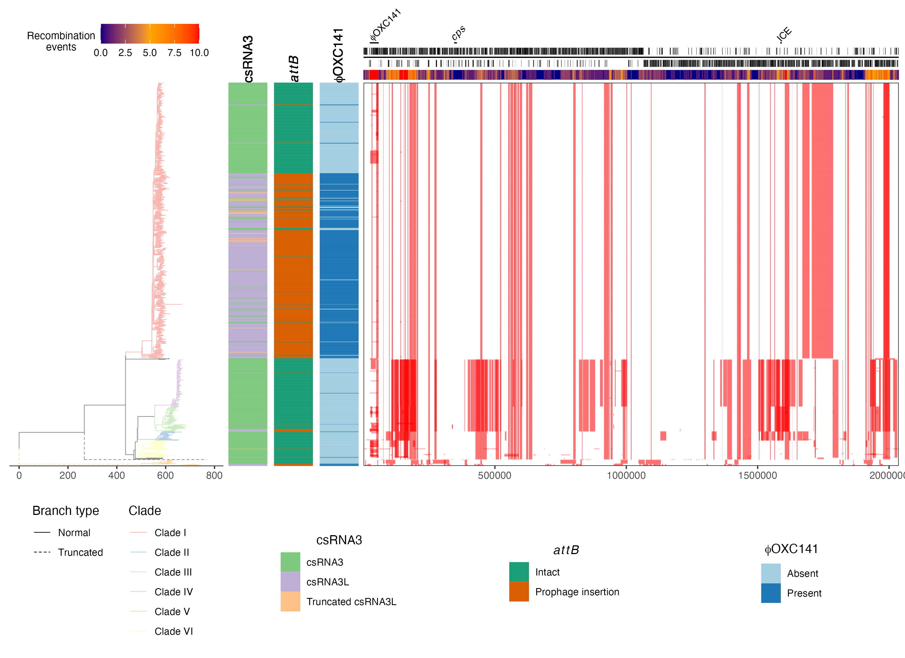

# Plotting Gubbins outputs

## Introduction

The R script `plot_gubbins.R` can be used to generate figures for publications. It should be installed automatically with the main algorithm. The script has a number of command line arguments, described below. Your particular dataset may well have percularities that require additional customisation, which is best addressed through [downloading](R/scripts/plot_gubbins.R) and manually editing the script yourself.

### Input files

The script combines output files from Gubbins with annotation of your reference sequence. Please note that the annotation will only match up with the recombination inference from Gubbins if other sequences were mapped to the reference, with no gaps introduced into the reference sequence - to test this, check the length of your alignment matches the length of your reference sequence.

```
  -t, --tree              Gubbins tree (Newick file)
  -r, --rec               Gubbins recombination inference (GFF file)
  -a, --annotation        Reference genome annotation (GFF file)
  -m, --markup            Genome loci to mark (CSV file; columns are
                          'start','end','label')
  --meta                  Metadata for each sequence (CSV file; first
                          column is 'id')
  -c, --clades            Assignment of taxa to clades (CSV file;
                          columns are 'id','clade')
```

The markup CSV should marks regions of particular interest in your annotation. The `label` column of this file can use [R plotmath](https://stat.ethz.ch/R-manual/R-devel/library/grDevices/html/plotmath.html) formatting. If you prefer to directly read the labels from the annotation GFF instead, then using the flag `--annotation-labels` will instead read the annotation from the `gene` qualifiers in this GFF file.

The metadata CSV should be one row per sequence, and one column per characteristic to be plotted. The first ID column should match exactly with the names on the Gubbins tree, which may not be identical with the original names of your sequences, due to the constraints of phylogenetic software (try only plotting the tree with `--show-taxa` to check this). The columns of the headers can use can use [R plotmath](https://stat.ethz.ch/R-manual/R-devel/library/grDevices/html/plotmath.html) formatting.

The clades CSV should assign sequences (not necessarily all of those in the tree) to groups. These will be reconstructed and coloured through the phylogeny using the `groupOTU` command of `ggtree` (explained in the [ggtree guide](https://yulab-smu.top/treedata-book/chapter4.html)).

### Output file

```
  -o, --output            Output file name (PNG or PDF suffix)
  --output-height         Height of output file (inches) [default: 8]
  --output-width          Width of output file (inches) [default: 11]

```

The output file should have a `.pdf` or `.png` suffix, depending on your preferred file format.

### Scaling factors for different panels

```
  --tree-width            Width of tree relative to recombination panel
                          [default: 0.4]
  --meta-width            Width of metadata panel relative to
                          recombination panel [default: 0.25]
  --annotation-height     Height of annotation panel relative to
                          recombination panel [default: 0.05]
  --markup-height         Height of markup panel relative to
                          recombination panel [default: 0.075]
  --heatmap-height        Height of heatmap relative to recombination
                          panel [default: 0.025]
  -l, --legend-height     Height of legends relative to recombination
                          panel [default: 0.25]

```

Each component of the plot can be scaled relative to the recombination panel, which has a fixed size of one in the vertical and horizontal directions.

### Focussing on a particular region

```
  -s, --start-coordinate  Left boundary of genomic region to plot
  -e, --end-coordinate    Right boundary of genomic region to plot
```

The plot can be constrained to a particular region of the genome.

### Positioning legends

```
  --heatmap-y-nudge       Size of metadata labels [default: 0]
  --heatmap-x-nudge       Size of metadata labels [default: 0]
  --legend-direction      Orientation of legends (horizontal or
                          vertical)
```

The heatmap legend will appear above the phylogeny, but may need repositioning, depending on the size of your dataset, and the detail of your annotation. The plots below the main panels may have a vertical or horizontal orientation.

### Labelling and tree size

```
  -n, --no-heatmap        Do not plot recombination heatmap
  --show-taxa             Show taxa names on tree
  --annotation-labels     Show GFF gene names on annotation
  --taxon-label-size      Size of taxon labels [default: 4]
  --meta-label-size       Size of metadata labels [default: 4]
  --max-branch-length     Maximum length at which to truncate branches
                          [default: Inf]
  --tree-axis-expansion   Space between tree and right panel [default:
                          5]
  -b, --branch-width      Width of branches on tree plot [default:
                          0.25]
```

These options provide flexibility with regard to the labelling of different components of the figure, and the relative scale of different aspects of the phylogeny.

### Example

Using files from the associated [FigShare repository](https://figshare.com/account/projects/130637/articles/24117117), we can replicate the analysis shown in [Kwun, Ion, Cheng *et al*](https://genomemedicine.biomedcentral.com/articles/10.1186/s13073-022-01147-2) with the command:

```
plot_gubbins.R --tree serotype_3.tre --rec serotype_3_recombination.gff --annotation serotype_3_annotation.gff  --meta serotype_3_metadata.csv --max-branch-length 500 --clades serotype_3_clades.csv --markup serotype_3_markup.csv --legend-height 0.35  --tree-axis-expansion 30 --markup-height 0.1 --heatmap-x-nudge 0.05 --heatmap-y-nudge -0.05 --output serotype_3.png
```

This should produce an output similar to:



A suggested legend is:

Analysis of the evolutionary history of *S. pneumoniae* GPSC12. The panel on the left shows the maximum-likelihood phylogeny built from clonal frame of GPSC12 isolates. The scale below shows the length of branches in base substitutions (N.B. if the tree is time-scaled, then this axis will reflect the time units used for the inference of the molecular clock). The dashed lines represent branches that have been truncated at a maximum length of 500 base substitutions. The tree is coloured according to the classification of isolates, each of which corresponds to a row in the panel on the right. Each column in this panel is a base in the reference annotation, the annotation of which is shown at the top of the figure. The panel shows the distribution of inferred recombination events, which are coloured blue is they are unique to a single isolate, or red, if they are shared by multiple isolates through common ancestry.
