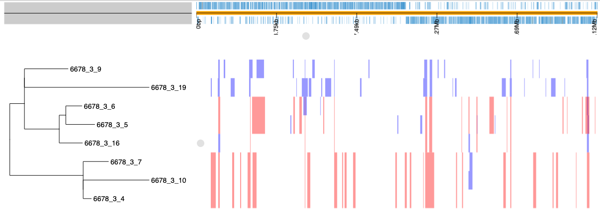

# Generating and analysing alignments with Gubbins

## Dataset

This dataset comprises a handful of genomes from *S. pneumoniae* PMEN3, a multidrug-resistant strain described in detail in [D'Aeth *et al*](https://elifesciences.org/articles/67113). It can be downloaded from [FigShare](https://figshare.com/account/projects/130637/articles/18700289). This consists of one complete reference sequence (*S. pneumoniae* RMV4) and eight draft genomes. These can be extracted with the command:

```
tar xfz PMEN3_assemblies.tar.gz
```

## Generating the alignment

The draft genomes can be aligned to the reference using [SKA](https://github.com/simonrharris/SKA). This is first installed through conda:

```
conda install -c bioconda ska
```

An index file is then generated to name the isolates to be aligned:

```
for f in 6678*fa; do echo "${f%.fa}\t${f}"; done > PMEN3_isolates.list
```

The `PMEN3_isolates.list` should contain this text:

```
6678_3_10    6678_3_10.fa
6678_3_16    6678_3_16.fa
6678_3_19    6678_3_19.fa
6678_3_4    6678_3_4.fa
6678_3_5    6678_3_5.fa
6678_3_6    6678_3_6.fa
6678_3_7    6678_3_7.fa
6678_3_9    6678_3_9.fa
```

The alignment is then constructed using the Gubbins script `generate_ska_alignment.py`:

```
generate_ska_alignment.py --reference RMV4.fa --fasta PMEN3_isolates.list --out PMEN3.aln
```

## Analysis with Gubbins

The resulting whole genome alignment can then be generated using Gubbins:

```
run_gubbins.py --prefix PMEN3 PMEN3.aln
```

This should complete in under a minute. The results can be visualised using the website https://jameshadfield.github.io/phandango. Three files can be dragged and dropped onto the loading screen:

* `PMEN3.final_tree.tre`

* `PMEN3.recombination_predictions.gff`

* `RMV4.gff`

The output should resemble this image:

